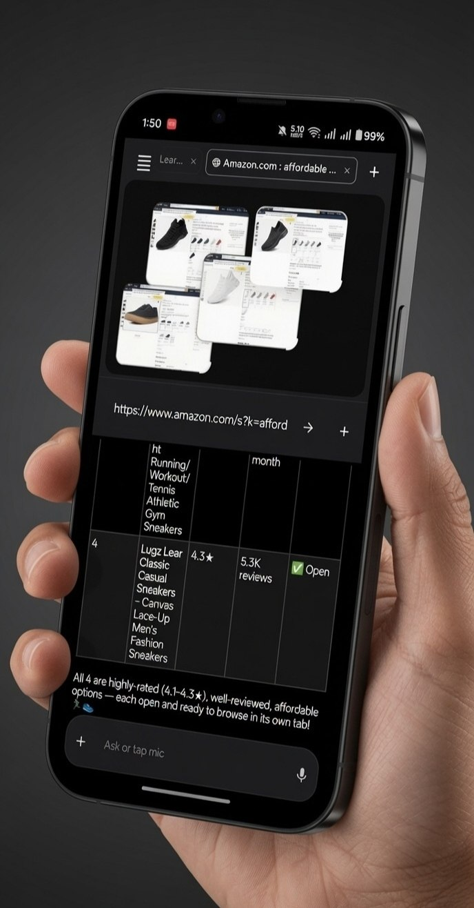
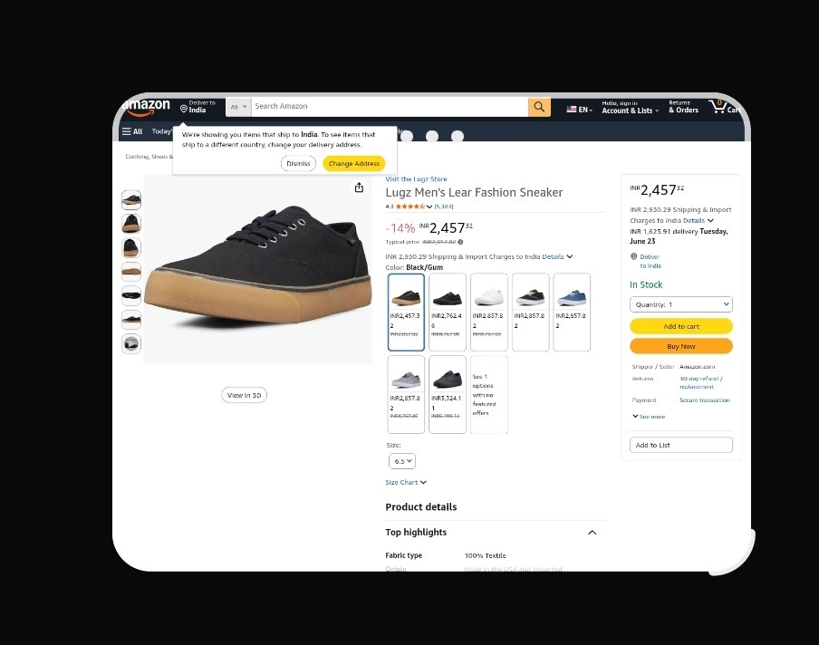
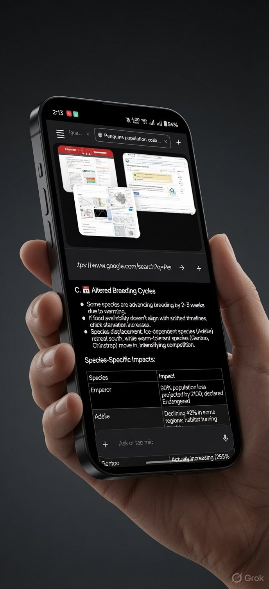
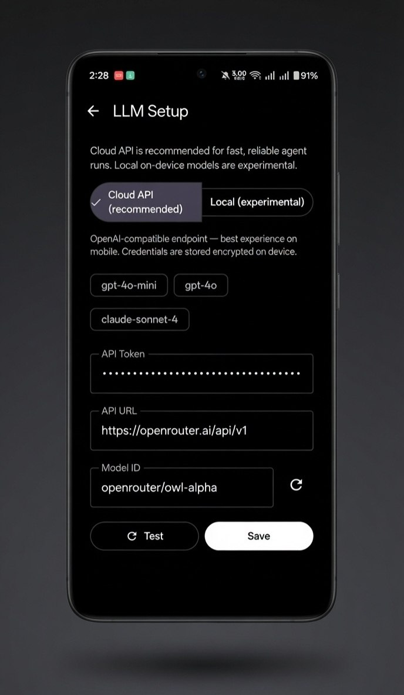
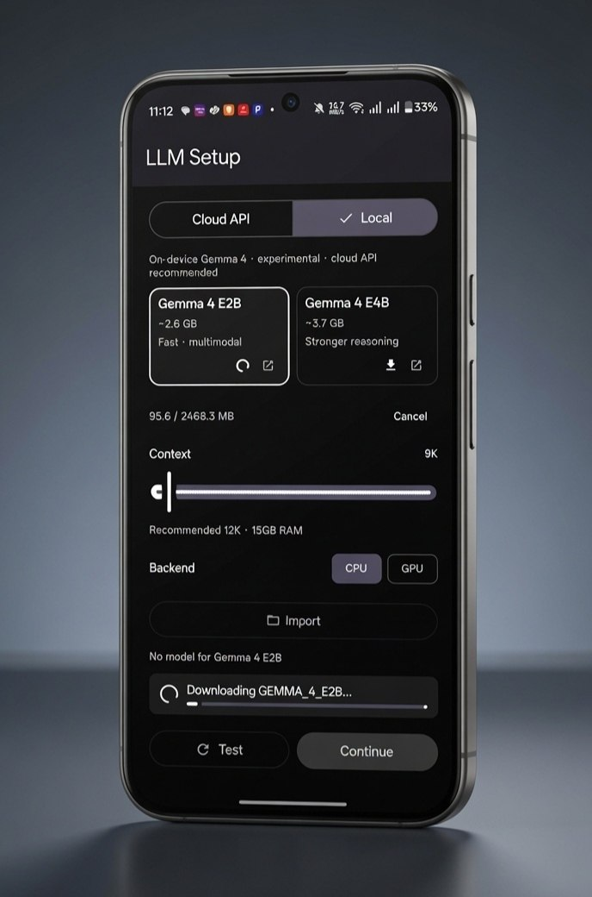
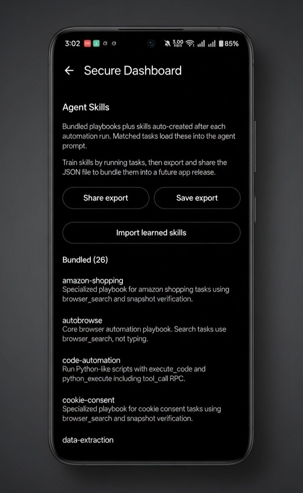
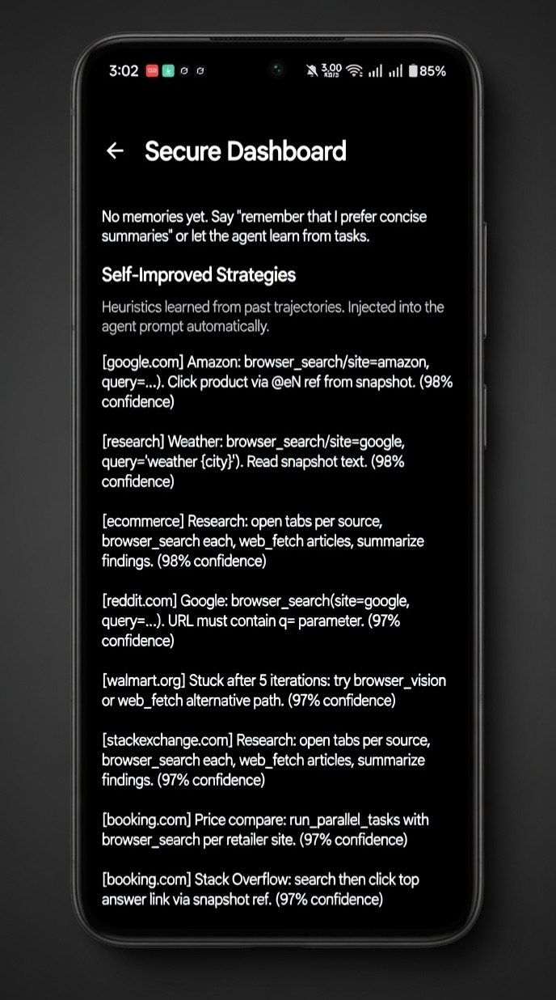
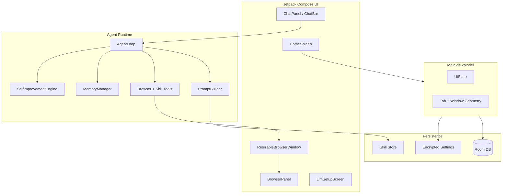

<div align="center">


<br/><br/>

# Multiwindow Autobrowser

**Floating browser windows. AI agent automation. Real mobile multitasking.**

[](https://github.com/Pixelgamer4k/autobrowse-android/actions/workflows/build-apk.yml)
[](https://developer.android.com)
[](https://kotlinlang.org)
[](https://developer.android.com/jetpack/compose)
[](#-roadmap)
[](#-roadmap)

*A hybrid mobile browser where every tab is a draggable, resizable floating window — powered by an LLM agent that can browse, research, and automate the web for you.*

<br/>



<br/>

[Features](#-features) · [Screenshots](#-screenshots--walkthrough) · [Roadmap](#-roadmap) · [Architecture](#-architecture) · [LLM Setup](#-llm-setup) · [Download](#-download)

</div>

---

## Overview

**Multiwindow Autobrowser** brings desktop-class multi-window browsing to Android. Instead of flipping between full-screen tabs, you work with **independent floating browser windows** — each with its own URL, scroll position, and lifecycle. Drag them around, resize from the corner, maximize, minimize, or stack them while you research.

On top of that sits a **browser automation agent**: describe a task in natural language and the agent navigates pages, fills forms, extracts data, opens new windows, and learns from successful workflows.

| | |
|---|---|
| **Multi-window canvas** | Several live browser windows on one screen |
| **Corner resize grip** | Minimal arc handle, slightly outside the frame |
| **3-dot window chrome** | Tap to drag; menu for refresh / maximize / close |
| **Agent chat bar** | Voice or text — "open 4 affordable sneakers on Amazon" |
| **Cloud or local LLM** | OpenRouter-compatible API or on-device LiteRT-LM (Gemma 4) |
| **Skills & memory** | Reusable playbooks that improve over time |

### Where we're headed

**Open source forever** — APKs on GitHub, no Play Store. **Flagship phones, foldables, and tablets** only: enough RAM for many live WebViews plus optional on-device Gemma 4.

The project is building toward a **desktop-class canvas on mobile**: saved desks, parallel agents per window, cross-window compare, vision over the full canvas, mission verticals (shopping war room, literature lab, travel board), voice control, headless APIs, and community skill packs — not a slimmed-down browser for low-end hardware.

| Horizon | Examples |
|---------|----------|
| **Near** | Snap grid, mission layouts, per-window agent scope, trajectory replay, scheduled missions |
| **Mid** | Canvas vision, research brief export, skill registry, shopping/travel/job verticals, push-to-talk |
| **Far** | Headless API, MCP bridge, DeX desks, isolated cookie jars, contributor playbook CI |
| **Moonshot** | Swarm windows, generative desk layouts, agent debates, time-travel browsing |

See the [full roadmap](#-roadmap) (~90 items) — a living map, not a dated promise.

---

## Features

### Floating window engine

Each browser tab renders as a **self-contained window unit** with rounded corners, elevation shadows, and spring-settle animations. Windows maintain a **4:3 content aspect ratio** when resized from the bottom-right corner.

- **Drag** — three-dot handle on the title bar
- **Resize** — corner arc grip offset outside the frame
- **Maximize / minimize** — from the window options menu
- **Multi-window sync** — geometry persisted per tab in Room

See [§1 Window unit](#1-window-unit--the-building-block) in the walkthrough for a full-size mockup.

### Agent-driven multitasking

The agent understands your open windows and can orchestrate complex workflows: parallel product comparison, multi-source research, form filling, data extraction, and tab management — all through tool calls like `browser_search`, `browser_snapshot`, `browser_click`, and `browser_tab_open`.

While the agent works, the chat panel shows a live **thinking indicator** with turn progress — so you always know automation is running.

<p align="center">
  
  <br/>
  <sub><b>Agent runtime</b> — transparent feedback during multi-step browser automation.</sub>
</p>

### Deep research mode

Stack windows with maps, articles, and data tables. Perfect for literature reviews, species research, competitive analysis, or any task where context switching kills momentum.

See [§3 Research workspace](#3-research--windows-as-a-workspace) for the penguin climate-study demo.

### Skills, memory & self-improvement

- **Bundled skills** — 26+ playbooks for search, extraction, form-fill, e-commerce, and site-specific tasks
- **Learned skills** — export/import skill packs as JSON after successful agent runs
- **Strategy memory** — heuristics refined from past trajectories, injected into prompts automatically
- **Training corpus** — baked-in site templates and failure patterns

The **Secure Dashboard** centralizes skill management and self-improved strategies. See [§6](#6-secure-dashboard--agent-skills) and [§7](#7-secure-dashboard--self-improved-strategies).

### Attachments & rich chat

Send images, PDFs, or videos alongside your prompt. The agent can reference attachments during browsing tasks. Chat supports Markdown rendering with syntax highlighting.

---

## Screenshots & walkthrough

### 1. Window unit — the building block

Every tab in Multiwindow Autobrowser is a **window unit**: a floating card with three-dot controls, live WebView content, and an outside-corner resize grip. The mockup below shows a full Amazon product page rendered inside a single window on a dark canvas — exactly how windows appear when arranged on the home screen.

| Detail | What you see |
|--------|----------------|
| Window chrome | Rounded frame, subtle shadow, three-dot menu |
| Web content | Full sites (e-commerce, search, docs) — not stripped-down mobile shells |
| Resize affordance | Corner arc only — no heavy outer L-bracket |



---

### 2. Multi-tab shopping — compare without switching

The hero image above shows the end result: ask the agent to find and open multiple products, and each result lands in **its own window** — overlapping on the canvas so you can glance across options instantly. The sneakers demo opens four affordable, highly-rated options (4.1–4.3★) on Amazon, each independently scrollable.

**Example prompt:**
> *"Find 4 affordable highly-rated men's sneakers on Amazon and open each in its own window."*

---

### 3. Research — windows as a workspace

The penguin research mockup shows how researchers use Multiwindow Autobrowser: one window for the article, another for species data, a third for maps — while the agent chat summarizes climate impacts below.

**Example prompt:**
> *"Research how climate change affects penguin breeding cycles. Open sources side by side and summarize species-specific impacts."*



---

### 4. LLM setup — Cloud API (recommended)

On first launch, configure your model backend. **Cloud API is the recommended path** — fast, reliable, and OpenAI-compatible. Credentials are encrypted on device.

| Field | Purpose |
|-------|---------|
| API Token | Your provider key (masked) |
| API URL | e.g. `https://openrouter.ai/api/v1` |
| Model ID | e.g. `openrouter/owl-alpha`, `gpt-4o-mini`, `claude-sonnet-4` |

Use **Test** to verify connectivity, then **Save**.

<p align="center">
  
</p>

---

### 5. LLM setup — Local on-device (experimental)

For offline or privacy-focused use, download a **LiteRT-LM** model (`.litertlm`) directly to your phone. The catalog includes **Gemma 4 E2B** (~2.6 GB, fast) and **Gemma 4 E4B** (~3.7 GB, stronger reasoning) — both support native tool calling and multimodal vision.

| Feature | Detail |
|---------|--------|
| Download | One-tap fetch from Hugging Face |
| Import | Bring your own `.litertlm` file |
| Context | RAM-aware defaults with slider up to 128K |
| Backends | CPU (compatible) or GPU (faster) |
| Storage | Delete downloaded models when done |

> Local models are experimental on mobile — expect slower agent runs than cloud API. A loading indicator appears during download, import, and engine warmup.

<p align="center">
  
</p>

---

### 6. Secure Dashboard — Agent Skills

The Secure Dashboard lists **bundled playbooks** and skills auto-created after automation runs. When a task matches a skill, its instructions load into the agent prompt. Export learned skills as JSON to share across installs or future releases.

| Capability | Detail |
|------------|--------|
| Bundled playbooks | 26 pre-built skills (amazon-shopping, data-extraction, code-automation, …) |
| Share / Save export | Package learned skills for backup or distribution |
| Import learned skills | Restore a skill pack from JSON |

<p align="center">
  
</p>

---

### 7. Secure Dashboard — Self-Improved Strategies

Strategies are **heuristics learned from past agent trajectories** — site-specific rules like "use `browser_search` on Amazon" or "open tabs per source for research." Each strategy carries a confidence score and is injected into the agent prompt automatically.

<p align="center">
  
</p>

---

## Architecture



### Layer breakdown

| Layer | Responsibility |
|-------|----------------|
| **UI** | Compose screens, floating windows, chat composer, sessions panel |
| **ViewModel** | Tab lifecycle, window geometry commits, agent job orchestration |
| **Browser** | WebView controller, snapshot scripts, content color sampling |
| **Agent** | Hermes-style tiered prompts, tool dispatch, trajectory logging |
| **Data** | Room entities for tabs/sessions/memory; encrypted LLM credentials |

### Key modules

```
app/src/main/java/com/autobrowse/android/
├── ui/components/     ResizableBrowserWindow, BrowserPanel, ChatBar
├── browser/           WindowGeometry, FloatingWindowEngine, TabManager
├── agent/             AgentLoop, PromptBuilder, tools/, training/
├── skills/            SkillRegistry, bundled + learned skill packs
└── data/              Room database, repository, local LLM service
```

---

## LLM Setup

### Cloud API (recommended)

1. Open **LLM Setup** on first launch (or Settings → LLM Setup).
2. Select **Cloud API (recommended)**.
3. Enter your API token, endpoint URL, and model ID.
4. Tap **Test**, then **Save**.

Works with any **OpenAI-compatible** endpoint — OpenRouter, OpenAI, local LiteLLM proxies, etc.

### Local models (experimental)

1. Select **Local**.
2. Pick **Gemma 4 E2B** or **Gemma 4 E4B**, or **Import** a `.litertlm` file.
3. Download (or import) and wait for the loading indicator to finish.
4. Adjust context window and **CPU** / **GPU** backend if needed.
5. Tap **Test**, then **Continue**.

---

## Download

APKs are **built on GitHub Actions** — no local Gradle build required on your phone or low-power machine.

### Latest release (recommended)

Install the signed release APK from the [**Releases**](https://github.com/Pixelgamer4k/autobrowse-android/releases/latest) page:

| File | Description |
|------|-------------|
| `Multiwindow-Autobrowser.apk` | Signed release — daily use |
| `Multiwindow-Autobrowser-debug.apk` | Debug build — testing only |
| `SHA256SUMS.txt` | Checksums |

Current release: [**v1.2.0**](https://github.com/Pixelgamer4k/autobrowse-android/releases/tag/v1.2.0)

### Latest CI debug build

Every push to `main` also builds a debug APK:

1. Go to [**Actions → Build APK**](https://github.com/Pixelgamer4k/autobrowse-android/actions/workflows/build-apk.yml)
2. Open the latest successful run
3. Download the **`Multiwindow-Autobrowser-debug`** artifact
4. Install on your Android device (API 26+)

You can also trigger a manual build from the **Run workflow** button on that page.

### Publish a new release

Push a version tag (e.g. `v1.1.11`) or run [**Actions → Release APK**](https://github.com/Pixelgamer4k/autobrowse-android/actions/workflows/release.yml) manually. CI builds both APKs, signs the release build, and publishes them to the Releases tab.

---

## Build from source (optional)

> **Note:** Local builds need a powerful x86_64 machine with Android SDK. If your device cannot run Gradle, use the GitHub Actions workflows above instead.

```bash
git clone https://github.com/Pixelgamer4k/autobrowse-android.git
cd autobrowse-android
./gradlew assembleDebug    # debug APK
./gradlew assembleRelease  # signed release (requires keystore.properties)
```

---

## Agent capabilities

The agent ships with **40+ browser tools** including:

| Category | Tools |
|----------|-------|
| Navigation | `browser_navigate`, `browser_search`, `browser_go_back`, `browser_reload` |
| Interaction | `browser_click`, `browser_type`, `browser_press_key`, `browser_scroll` |
| Inspection | `browser_snapshot`, `browser_get_links`, `browser_readability`, `browser_screenshot` |
| Tabs / windows | `browser_tab_open`, `browser_tab_close`, `browser_tab_switch`, `browser_tab_list` |
| Extraction | `browser_extract_table`, `browser_extract_forms`, `browser_extract_metadata` |
| Overlays | `browser_accept_cookies`, `browser_dismiss_overlays`, `browser_close_modal` |
| Skills | `skill_list`, `skill_view`, `skill_creator`, `skill_manage` |

Prompt assembly follows a **tiered Hermes-inspired structure**: stable identity → context/memory → skills → volatile page state.

---

## Window controls quick reference

| Gesture | Action |
|---------|--------|
| Tap 3-dot handle | Open window menu (refresh, maximize, close) |
| Drag 3-dot handle | Move window on canvas |
| Drag corner arc | Resize window (4:3 locked) |
| Tap window body | Focus / bring to front |
| `+` in browser bar | Open new tab / window |

---

## Privacy & security

- LLM API tokens stored **encrypted on device**
- No telemetry or analytics SDK
- Local model weights stay on your phone
- Agent trajectories stored locally in Room for skill learning

---

## Tech stack

| | |
|---|---|
| Language | Kotlin |
| UI | Jetpack Compose, Material 3 |
| Browser | Android WebView |
| Database | Room |
| Background work | WorkManager |
| LLM (cloud) | OpenAI-compatible REST |
| LLM (local) | LiteRT-LM (`litertlm-android`) — Gemma 4 `.litertlm` |
| CI | GitHub Actions → `assembleDebug` |

---

## Roadmap

**Open source forever** — GitHub releases, no Play Store gatekeeping. Built for **flagship phones, foldables, and tablets** with the RAM to run many WebViews plus optional on-device Gemma 4. This is a living map, not a promise schedule. Plain-text copy: [`docs/ROADMAP.md`](docs/ROADMAP.md).

| Horizon | Meaning |
|---------|---------|
| **Near** | Next major releases — polish what exists, ship high-impact UX |
| **Mid** | New subsystems — multi-agent, canvas intelligence, creative outputs |
| **Far** | Platform bets — APIs, community scale, hardware-specific depth |
| **Moonshot** | Speculative — worth designing toward, not committing dates |

<details open>
<summary><b>Near — canvas & window orchestration</b> (12 items)</summary>

<br/>

- [ ] **Snap guides & magnetic grid** — windows align to edges and each other like a desktop WM
- [ ] **Mission layouts** — one-tap presets (2-up compare, 3-up research, 4-up shop grid) the agent can spawn and fill
- [ ] **Per-window agent scope** — pin the agent to one window; others stay visible but untouched
- [ ] **Canvas overview** — bird's-eye minimap of all live windows; tap to focus or drag to rearrange
- [ ] **Saved workspaces ("desks")** — freeze arrangement + URLs + scroll positions + agent session
- [ ] **Window groups** — color-coded clusters the agent treats as one mission (e.g. "sources", "candidates", "checkout")
- [ ] **Z-order lanes** — auto-layer windows by role: foreground work, reference strip, pinned notes
- [ ] **Corner & edge snap presets** — quarter-screen, half-screen, pillarbox reference column
- [ ] **Window thumbnails on hover** — peek page content without raising the window
- [ ] **Session restore on crash** — resurrect every window exactly where you left off
- [ ] **Foldable inner/outer canvas** — span windows across hinge or dedicate one screen to chat
- [ ] **Stylus precision mode** — fine click targets and lasso-select regions for the agent to read

</details>

<details>
<summary><b>Near — agent core upgrades</b> (12 items)</summary>

<br/>

- [ ] **Parallel window agents** — independent sub-agents per window with a coordinator merge step
- [ ] **Cross-window compare mode** — structured diff table or verdict across N product/article windows
- [ ] **Action macros → skills** — record taps/scrolls/type paths; export as skill JSON
- [ ] **Trajectory replay** — scrub agent runs on the canvas with click highlights per step
- [ ] **Mission templates** — price hunt, literature review, form marathon, competitor scan, job sweep
- [ ] **Scheduled missions** — WorkManager opens windows, runs agent, pushes notification on completion
- [ ] **Clarify-on-canvas** — agent points at the exact window/element it needs help with
- [ ] **Confidence gates** — pause and ask before irreversible actions (purchase, submit, delete)
- [ ] **Turn budget presets** — "quick glance" vs "deep research" iteration limits per mission
- [ ] **Smart retry policies** — site-specific backoff when rate-limited or layout-shifted
- [ ] **Human-in-the-loop checkpoints** — approve next N steps before agent continues
- [ ] **Multi-session branching** — fork a chat mid-mission without losing the original thread

</details>

<details>
<summary><b>Mid — multimodal canvas intelligence</b> (11 items)</summary>

<br/>

- [ ] **Vision across windows** — screenshot the full canvas; reason over spatial layout, not one DOM at a time
- [ ] **Element spotlight** — agent draws transient overlays on what it intends to click
- [ ] **Before/after capture** — auto snapshot after each tool call for audit and replay
- [ ] **Video frame strip** — sample keyframes from video tabs into the research brief
- [ ] **Attachment-aware missions** — drop a PDF/image; agent opens corroborating windows automatically
- [ ] **OCR fusion** — merge DOM text + vision OCR when sites hide content in canvases or images
- [ ] **Live synthesis panel** — running notes, citations, price tracker updating as windows change
- [ ] **Research brief export** — PDF/Markdown dossier from a multi-window session
- [ ] **Chart & doc pipeline** — tables → matplotlib charts → downloadable artifacts in-app
- [ ] **Citation graph** — which window supported which claim in the final summary
- [ ] **Audio briefings** — TTS readout of mission results while you scan windows visually

</details>

<details>
<summary><b>Mid — skills, memory & self-improvement</b> (11 items)</summary>

<br/>

- [ ] **Skill pack registry** — install community playbooks from GitHub URLs (no account)
- [ ] **Skill marketplace index** — curated open-source list in-repo, verified by CI smoke tests
- [ ] **Skill versioning & diff** — upgrade a playbook without breaking learned heuristics
- [ ] **Strategy tournaments** — A/B two heuristics on the same site; promote the winner automatically
- [ ] **Site DNA profiles** — auto-built fingerprints per domain (login walls, cookie patterns, search boxes)
- [ ] **Failure museum** — gallery of past mistakes with "don't do this again" injected into prompts
- [ ] **Cross-install skill sync** — export/import via QR, file, or local network (no cloud)
- [ ] **Long-horizon memory** — user prefs, accounts (non-secret), shopping sizes, research topics across months
- [ ] **Memory inspector** — see what the agent remembers; pin, edit, or forget entries
- [ ] **Autonomous skill authoring** — post-mission distillation into SKILL.md with human approve step
- [ ] **Playbook hot-reload** — edit bundled skills on device for power users

</details>

<details>
<summary><b>Mid — mission verticals</b> (10 items)</summary>

<br/>

- [ ] **Shopping war room** — track price, rating, shipping, return policy across windows; pick a winner
- [ ] **Literature lab** — abstract → sources → counter-sources → synthesis desk layout
- [ ] **Travel board** — flights, hotels, maps, reviews tiled; agent negotiates tradeoffs out loud
- [ ] **Job hunt dashboard** — listings, company research, application forms in grouped windows
- [ ] **Competitive intel** — feature matrix scraped from rival sites into a living table
- [ ] **Form bureaucracy mode** — government/visa/insurance multi-page flows with field memory
- [ ] **Bug repro theater** — reproduce issue in one window, docs/GitHub in others; export repro script
- [ ] **Recipe & meal planner** — ingredients from multiple stores compared side by side
- [ ] **Real estate sweep** — listings + map + school data + commute windows
- [ ] **Election / policy tracker** — news, primary sources, fact-check windows with stance summary

</details>

<details>
<summary><b>Mid — voice, gestures & ambient control</b> (8 items)</summary>

<br/>

- [ ] **Push-to-talk agent** — hold to speak a mission while hands stay on window drags
- [ ] **Voice window targeting** — "in the left Amazon window, sort by rating"
- [ ] **Gesture chords** — two-finger swipe to tile; pinch overview; long-press record macro
- [ ] **Quick mission launcher** — Android shortcut / widget: "open research desk on {topic}"
- [ ] **Notification actions** — approve, pause, or steer agent from shade without opening app
- [ ] **Ambient progress** — persistent notification with step label and ETA during long missions
- [ ] **Wear OS companion** — pause/resume, voice nudge, haptic checkpoint approvals
- [ ] **Shake to panic-stop** — instant agent halt and network hold

</details>

<details>
<summary><b>Far — platform & integrations</b> (9 items)</summary>

<br/>

- [ ] **Headless agent API** — local HTTP/WebSocket for scripts, Tasker, Home Assistant
- [ ] **Webhook ingress** — "price dropped" URL opens comparison desk and runs agent
- [ ] **Exportable workspace bundles** — desk + skills + strategies as one JSON archive
- [ ] **MCP tool bridge** — expose browser tools to external MCP clients on LAN
- [ ] **OpenAI-compatible local shim** — route other apps' tool calls through Autobrowse windows
- [ ] **RSS / calendar triggers** — scheduled fetches become morning briefing windows
- [ ] **Clipboard canvas** — paste a list of URLs; agent spawns and processes each in its own window
- [ ] **Share-target receiver** — share from Chrome → Autobrowse opens a new window in current desk
- [ ] **Kotlin embedding SDK** — drop floating browser agent into other open-source Android apps

</details>

<details>
<summary><b>Far — browser engine & site power</b> (9 items)</summary>

<br/>

- [ ] **Per-window user-agent & locale** — same site, different regions side by side
- [ ] **Isolated cookie jars per desk** — personal vs work vs research identities
- [ ] **Reader + snapshot hybrid** — clean article view feeding the agent when DOM is noisy
- [ ] **PDF tab type** — native in-canvas PDF with highlight tools for agent citation
- [ ] **Custom CSS injector per site** — strip clutter before agent snapshot (user-toggleable)
- [ ] **Network log per window** — see XHR failures the agent might miss
- [ ] **JavaScript console bridge** — agent runs guarded JS snippets for stubborn SPAs
- [ ] **Download manager desk** — files land in a window; agent summarizes archives
- [ ] **Tor / proxy per window** — optional privacy lane for sensitive research (power users)

</details>

<details>
<summary><b>Far — flagship hardware depth</b> (7 items)</summary>

<br/>

- [ ] **GPU-first local inference** — default GPU backend on Tensor / Adreno flagships with thermal guard
- [ ] **Speculative decoding path** — adopt LiteRT-LM MTP when bundled models support it
- [ ] **NPU experimental lane** — opt-in Google Tensor / Qualcomm paths when upstream stable
- [ ] **RAM-adaptive window cap** — dynamically limit open WebViews vs KV cache for local LLM
- [ ] **120 Hz canvas** — smooth drag/resize on high-refresh panels
- [ ] **External display desk** — DeX / HDMI: chat on phone, four windows on monitor
- [ ] **Pen + keyboard desktop mode** — laptop-class layout when docked

</details>

<details>
<summary><b>Far — community & governance</b> (7 items)</summary>

<br/>

- [ ] **Contributor playbook kit** — templates + CI for site-specific skills via PR
- [ ] **Public mission cookbook** — user-submitted prompt + desk recipes in `docs/missions/`
- [ ] **Open regression suite** — recorded trajectories replayed in CI against mock WebViews
- [ ] **Transparency log** — every agent run exportable as JSON for audit and research
- [ ] **Plugin ABI (experimental)** — load vetted JAR modules that register tools/skills
- [ ] **Localization** — UI + prompt packs for non-English agent missions
- [ ] **Accessibility pass** — TalkBack on chrome; high-contrast window borders; keyboard nav

</details>

<details>
<summary><b>Moonshot — where this could go</b> (10 items)</summary>

<br/>

- [ ] **Swarm mode** — dozens of micro-windows as a "sensor grid" over the entire web front page
- [ ] **Generative desk layouts** — describe a research goal; AI designs the window topology for you
- [ ] **Cross-device handoff** — start desk on tablet, continue on foldable with synced agent state
- [ ] **Collaborative async desks** — share a read-only canvas replay; friend records voice commentary
- [ ] **Time-travel browsing** — agent opens archive.org beside live site; diff narrative in synthesis panel
- [ ] **On-device fine-tune lane** — LoRA skills from your trajectories, exportable, still no cloud
- [ ] **Agent vs agent debates** — two local models argue across windows until synthesis resolves
- [ ] **Spatial "mind map" canvas** — windows orbit topics; edges show citation strength
- [ ] **Live web dashboard builder** — pin extracted metrics; auto-refresh windows on interval
- [ ] **Additional LiteRT model families** — only when flagship hardware and upstream `.litertlm` bundles mature

</details>

---

## Contributing

Issues and pull requests are welcome — especially for [roadmap](#-roadmap) items, site-specific skills, and mission templates. Please open an issue before large architectural changes.

1. Fork the repository
2. Create a feature branch
3. Verify CI passes on GitHub Actions (or run `./gradlew assembleDebug` if you have a capable build machine)
4. Submit a PR with screenshots for UI changes

---

## License

This project is provided as-is for personal and educational use. See repository terms for details.

---

<div align="center">

**Multiwindow Autobrowser** — *Browse many. Automate everything.*

<br/>

<sub>Mockups in <code>docs/mockups/</code> · <a href="#-roadmap">Roadmap</a> · Open source on GitHub · Built with Kotlin & Jetpack Compose</sub>

</div>