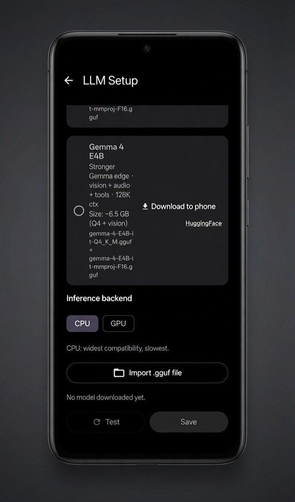
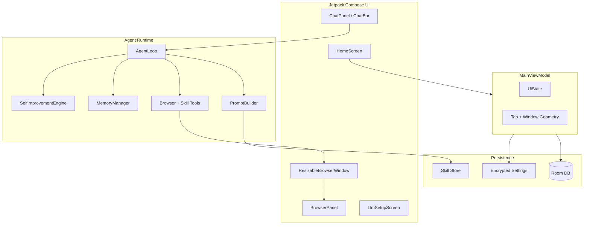

<div align="center">


<br/><br/>

# Multiwindow Autobrowser

**Floating browser windows. AI agent automation. Real mobile multitasking.**

[](https://github.com/Pixelgamer4k/autobrowse-android/actions/workflows/build-apk.yml)
[](https://developer.android.com)
[](https://kotlinlang.org)
[](https://developer.android.com/jetpack/compose)

*A hybrid mobile browser where every tab is a draggable, resizable floating window — powered by an LLM agent that can browse, research, and automate the web for you.*

<br/>


<br/>

[Features](#-features) · [Screenshots](#-screenshots--walkthrough) · [Architecture](#-architecture) · [LLM Setup](#-llm-setup) · [Build](#-build-from-source) · [Download](#-download)

</div>

---

## Overview

**Multiwindow Autobrowser** brings desktop-class multi-window browsing to Android. Instead of flipping between full-screen tabs, you work with **independent floating browser windows** — each with its own URL, scroll position, and lifecycle. Drag them around, resize from the corner, maximize, minimize, or stack them while you research.

On top of that sits a **browser automation agent**: describe a task in natural language and the agent navigates pages, fills forms, extracts data, opens new windows, and learns from successful workflows.

| | |
|---|---|
| **Multi-window canvas** | Several live browser windows on one screen |
| **Corner resize grip** | Minimal arc handle, slightly outside the frame |
| **3-dot window chrome** | Tap to drag; menu for refresh / maximize / close |
| **Agent chat bar** | Voice or text — "open 4 affordable sneakers on Amazon" |
| **Cloud or local LLM** | OpenRouter-compatible API or on-device GGUF models |
| **Skills & memory** | Reusable playbooks that improve over time |

---

## Features

### Floating window engine

Each browser tab renders as a **self-contained window unit** with rounded corners, elevation shadows, and spring-settle animations. Windows maintain a **4:3 content aspect ratio** when resized from the bottom-right corner.

- **Drag** — three-dot handle on the title bar
- **Resize** — corner arc grip offset outside the frame
- **Maximize / minimize** — from the window options menu
- **Multi-window sync** — geometry persisted per tab in Room

See [§1 Window unit](#1-window-unit--the-building-block) in the walkthrough for a full-size mockup.

### Agent-driven multitasking

The agent understands your open windows and can orchestrate complex workflows: parallel product comparison, multi-source research, form filling, data extraction, and tab management — all through tool calls like `browser_search`, `browser_snapshot`, `browser_click`, and `browser_tab_open`.

While the agent works, the chat panel shows a live **thinking indicator** with turn progress — so you always know automation is running.

<p align="center">
  
  <br/>
  <sub><b>Agent runtime</b> — transparent feedback during multi-step browser automation.</sub>
</p>

### Deep research mode

Stack windows with maps, articles, and data tables. Perfect for literature reviews, species research, competitive analysis, or any task where context switching kills momentum.

See [§3 Research workspace](#3-research--windows-as-a-workspace) for the penguin climate-study demo.

### Skills, memory & self-improvement

- **Bundled skills** — 26+ playbooks for search, extraction, form-fill, e-commerce, and site-specific tasks
- **Learned skills** — export/import skill packs as JSON after successful agent runs
- **Strategy memory** — heuristics refined from past trajectories, injected into prompts automatically
- **Training corpus** — baked-in site templates and failure patterns

The **Secure Dashboard** centralizes skill management and self-improved strategies. See [§6](#6-secure-dashboard--agent-skills) and [§7](#7-secure-dashboard--self-improved-strategies).

### Attachments & rich chat

Send images, PDFs, or videos alongside your prompt. The agent can reference attachments during browsing tasks. Chat supports Markdown rendering with syntax highlighting.

---

## Screenshots & walkthrough

### 1. Window unit — the building block

Every tab in Multiwindow Autobrowser is a **window unit**: a floating card with three-dot controls, live WebView content, and an outside-corner resize grip. The mockup below shows a full Amazon product page rendered inside a single window on a dark canvas — exactly how windows appear when arranged on the home screen.

| Detail | What you see |
|--------|----------------|
| Window chrome | Rounded frame, subtle shadow, three-dot menu |
| Web content | Full sites (e-commerce, search, docs) — not stripped-down mobile shells |
| Resize affordance | Corner arc only — no heavy outer L-bracket |


---

### 2. Multi-tab shopping — compare without switching

The hero image above shows the end result: ask the agent to find and open multiple products, and each result lands in **its own window** — overlapping on the canvas so you can glance across options instantly. The sneakers demo opens four affordable, highly-rated options (4.1–4.3★) on Amazon, each independently scrollable.

**Example prompt:**
> *"Find 4 affordable highly-rated men's sneakers on Amazon and open each in its own window."*

---

### 3. Research — windows as a workspace

The penguin research mockup shows how researchers use Multiwindow Autobrowser: one window for the article, another for species data, a third for maps — while the agent chat summarizes climate impacts below.

**Example prompt:**
> *"Research how climate change affects penguin breeding cycles. Open sources side by side and summarize species-specific impacts."*


---

### 4. LLM setup — Cloud API (recommended)

On first launch, configure your model backend. **Cloud API is the recommended path** — fast, reliable, and OpenAI-compatible. Credentials are encrypted on device.

| Field | Purpose |
|-------|---------|
| API Token | Your provider key (masked) |
| API URL | e.g. `https://openrouter.ai/api/v1` |
| Model ID | e.g. `openrouter/owl-alpha`, `gpt-4o-mini`, `claude-sonnet-4` |

Use **Test** to verify connectivity, then **Save**.

<p align="center">
  
</p>

---

### 5. LLM setup — Local on-device (experimental)

For offline or privacy-focused use, download a **GGUF model** directly to your phone. The local path supports CPU/GPU inference backends and HuggingFace downloads (e.g. Gemma variants with vision + tools).

> Local models are experimental on mobile — slower and more resource-intensive. Cloud API is strongly recommended for production agent runs.

<p align="center">
  
</p>

---

### 6. Secure Dashboard — Agent Skills

The Secure Dashboard lists **bundled playbooks** and skills auto-created after automation runs. When a task matches a skill, its instructions load into the agent prompt. Export learned skills as JSON to share across installs or future releases.

| Capability | Detail |
|------------|--------|
| Bundled playbooks | 26 pre-built skills (amazon-shopping, data-extraction, code-automation, …) |
| Share / Save export | Package learned skills for backup or distribution |
| Import learned skills | Restore a skill pack from JSON |

<p align="center">
  
</p>

---

### 7. Secure Dashboard — Self-Improved Strategies

Strategies are **heuristics learned from past agent trajectories** — site-specific rules like "use `browser_search` on Amazon" or "open tabs per source for research." Each strategy carries a confidence score and is injected into the agent prompt automatically.

<p align="center">
  
</p>

---

## Architecture



### Layer breakdown

| Layer | Responsibility |
|-------|----------------|
| **UI** | Compose screens, floating windows, chat composer, sessions panel |
| **ViewModel** | Tab lifecycle, window geometry commits, agent job orchestration |
| **Browser** | WebView controller, snapshot scripts, content color sampling |
| **Agent** | Hermes-style tiered prompts, tool dispatch, trajectory logging |
| **Data** | Room entities for tabs/sessions/memory; encrypted LLM credentials |

### Key modules

```
app/src/main/java/com/autobrowse/android/
├── ui/components/     ResizableBrowserWindow, BrowserPanel, ChatBar
├── browser/           WindowGeometry, FloatingWindowEngine, TabManager
├── agent/             AgentLoop, PromptBuilder, tools/, training/
├── skills/            SkillRegistry, bundled + learned skill packs
└── data/              Room database, repository, local LLM service
```

---

## LLM Setup

### Cloud API (recommended)

1. Open **LLM Setup** on first launch (or Settings → LLM Setup).
2. Select **Cloud API (recommended)**.
3. Enter your API token, endpoint URL, and model ID.
4. Tap **Test**, then **Save**.

Works with any **OpenAI-compatible** endpoint — OpenRouter, OpenAI, local LiteLLM proxies, etc.

### Local models (experimental)

1. Select **Local (experimental)**.
2. Pick a model card or **Import .gguf file**.
3. Choose **CPU** or **GPU** inference backend.
4. Download, test, and save.

---

## Download

APKs are **built on GitHub Actions** — no local Gradle build required on your phone or low-power machine.

### Latest release (recommended)

Install the signed release APK from the [**Releases**](https://github.com/Pixelgamer4k/autobrowse-android/releases/latest) page:

| File | Description |
|------|-------------|
| `Multiwindow-Autobrowser.apk` | Signed release — daily use |
| `Multiwindow-Autobrowser-debug.apk` | Debug build — testing only |
| `SHA256SUMS.txt` | Checksums |

Current release: [**v1.1.10**](https://github.com/Pixelgamer4k/autobrowse-android/releases/tag/v1.1.10)

### Latest CI debug build

Every push to `main` also builds a debug APK:

1. Go to [**Actions → Build APK**](https://github.com/Pixelgamer4k/autobrowse-android/actions/workflows/build-apk.yml)
2. Open the latest successful run
3. Download the **`Multiwindow-Autobrowser-debug`** artifact
4. Install on your Android device (API 26+)

You can also trigger a manual build from the **Run workflow** button on that page.

### Publish a new release

Push a version tag (e.g. `v1.1.11`) or run [**Actions → Release APK**](https://github.com/Pixelgamer4k/autobrowse-android/actions/workflows/release.yml) manually. CI builds both APKs, signs the release build, and publishes them to the Releases tab.

---

## Build from source (optional)

> **Note:** Local builds need a powerful x86_64 machine with Android SDK. If your device cannot run Gradle, use the GitHub Actions workflows above instead.

```bash
git clone https://github.com/Pixelgamer4k/autobrowse-android.git
cd autobrowse-android
./gradlew assembleDebug    # debug APK
./gradlew assembleRelease  # signed release (requires keystore.properties)
```

---

## Agent capabilities

The agent ships with **40+ browser tools** including:

| Category | Tools |
|----------|-------|
| Navigation | `browser_navigate`, `browser_search`, `browser_go_back`, `browser_reload` |
| Interaction | `browser_click`, `browser_type`, `browser_press_key`, `browser_scroll` |
| Inspection | `browser_snapshot`, `browser_get_links`, `browser_readability`, `browser_screenshot` |
| Tabs / windows | `browser_tab_open`, `browser_tab_close`, `browser_tab_switch`, `browser_tab_list` |
| Extraction | `browser_extract_table`, `browser_extract_forms`, `browser_extract_metadata` |
| Overlays | `browser_accept_cookies`, `browser_dismiss_overlays`, `browser_close_modal` |
| Skills | `skill_list`, `skill_view`, `skill_creator`, `skill_manage` |

Prompt assembly follows a **tiered Hermes-inspired structure**: stable identity → context/memory → skills → volatile page state.

---

## Window controls quick reference

| Gesture | Action |
|---------|--------|
| Tap 3-dot handle | Open window menu (refresh, maximize, close) |
| Drag 3-dot handle | Move window on canvas |
| Drag corner arc | Resize window (4:3 locked) |
| Tap window body | Focus / bring to front |
| `+` in browser bar | Open new tab / window |

---

## Privacy & security

- LLM API tokens stored **encrypted on device**
- No telemetry or analytics SDK
- Local model weights stay on your phone
- Agent trajectories stored locally in Room for skill learning

---

## Tech stack

| | |
|---|---|
| Language | Kotlin |
| UI | Jetpack Compose, Material 3 |
| Browser | Android WebView |
| Database | Room |
| Background work | WorkManager |
| LLM (cloud) | OpenAI-compatible REST |
| LLM (local) | GGUF via on-device inference |
| CI | GitHub Actions → `assembleDebug` |

---

## Roadmap

- [ ] Release signing & Play Store listing
- [ ] Window snap guides and grid alignment
- [ ] Split-screen preset layouts (2-up, 3-up, 4-up)
- [ ] Per-window agent focus ("work in this window only")
- [ ] Improved local model performance on flagship SoCs

---

## Contributing

Issues and pull requests are welcome. Please open an issue before large architectural changes.

1. Fork the repository
2. Create a feature branch
3. Verify CI passes on GitHub Actions (or run `./gradlew assembleDebug` if you have a capable build machine)
4. Submit a PR with screenshots for UI changes

---

## License

This project is provided as-is for personal and educational use. See repository terms for details.

---

<div align="center">

**Multiwindow Autobrowser** — *Browse many. Automate everything.*

<br/>

<sub>Mockups in <code>docs/mockups/</code> · Built with Kotlin & Jetpack Compose · CI builds on every push</sub>

</div>